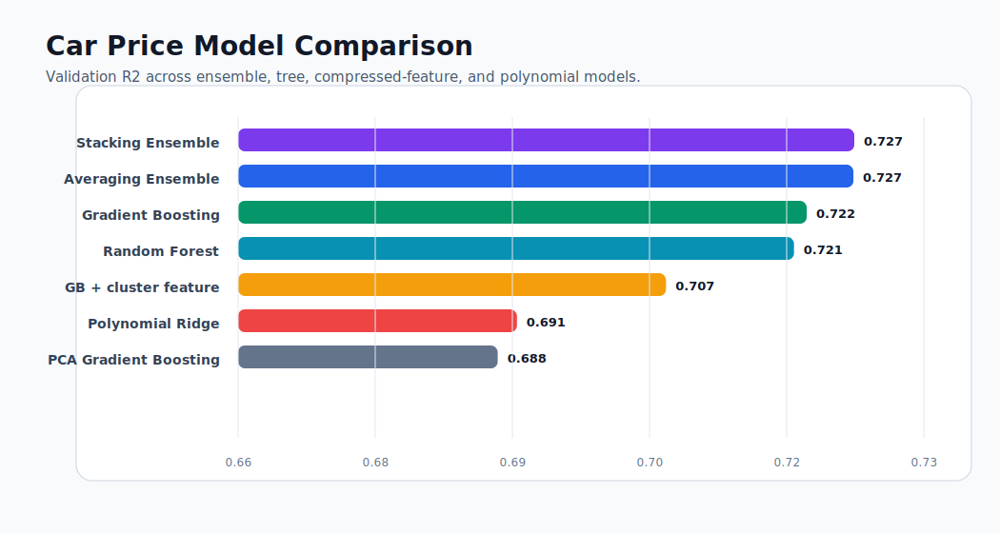
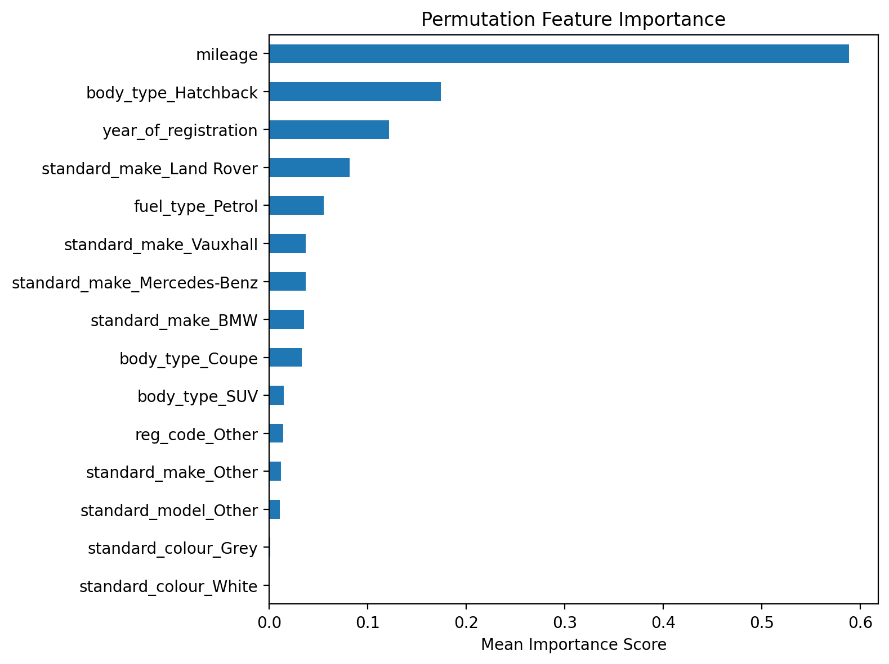
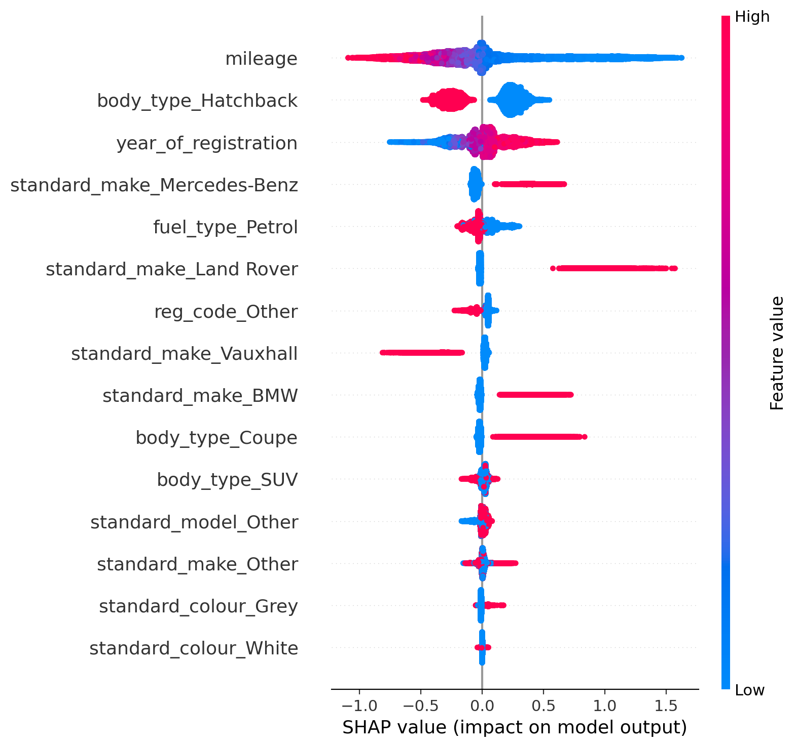
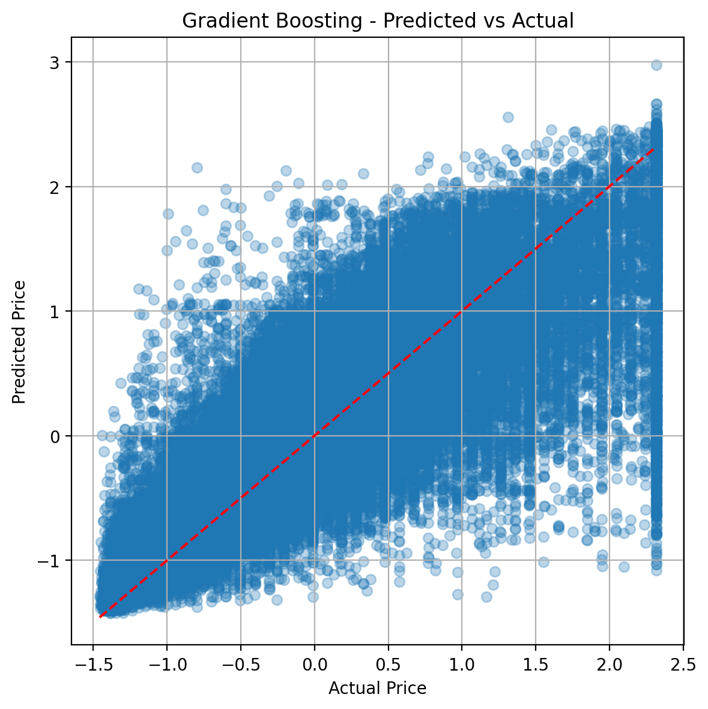

# Used Car Price Modeling

An end-to-end tabular machine-learning workflow for estimating used-car listing prices from structured advert data. The project combines careful data preparation, feature selection, tree ensembles, stacked generalisation, dimensionality-reduction experiments, and model explainability.

## Problem

Used-car pricing is shaped by interacting signals: mileage, age, manufacturer, model, body type, fuel type, colour, condition, and market timing. The objective is to build a model that captures those non-linear relationships while remaining interpretable enough to explain why a prediction moved up or down.

## Modelling Approach

- Profile missingness and repair fields with domain-aware group imputations.
- Treat mileage and price outliers without flattening meaningful premium-vehicle behaviour.
- Encode high-cardinality categorical variables while controlling feature explosion.
- Split train, validation, and test data before feature selection.
- Use Recursive Feature Elimination with a Random Forest estimator to keep the signal compact.
- Compare Random Forest, Gradient Boosting, averaged ensembles, and stacked ensembles.
- Benchmark feature-compressed variants with PCA and Isomap.
- Test polynomial Ridge regression and KMeans-derived cluster features.
- Interpret model behaviour with permutation importance, SHAP, and partial dependence plots.

## Results

Validation results from the advanced modelling notebook:



| Model | Validation R2 |
| --- | ---: |
| Random Forest | 0.7208 |
| Gradient Boosting | 0.7222 |
| Averaging Ensemble | 0.7273 |
| Stacking Ensemble | 0.7274 |
| PCA Gradient Boosting | 0.6884 |
| Polynomial Ridge | 0.6905 |
| Gradient Boosting with cluster feature | 0.7068 |

The stacked ensemble gives the best validation score, and the explainability work shows the dominant influence of mileage, registration year, and body/model attributes. The compressed-feature experiments are deliberately included: they show where information is lost and why the tree ensemble remains the better modelling choice for this dataset.

## Explainability





The model is most sensitive to mileage, body type, registration year, and premium manufacturer signals. The SHAP and permutation-importance views give complementary explanations: one focused on marginal performance impact, the other on directional contribution across the validation set.

## Prediction Behaviour



## Repository Structure

```text
.
├── notebooks/
│   ├── advanced_car_price_modeling.ipynb
│   └── baseline_car_price_modeling.ipynb
├── data/
│   └── README.md
├── docs/
│   └── technical_brief.md
├── requirements.txt
└── README.md
```

## Data Contract

Place the advert dataset at:

```text
data/adverts.csv
```

The expected target column is `price`. The notebooks assume structured advert fields for mileage, registration year, make, model, fuel type, body type, colour, condition, and public listing reference.

## Run

```bash
python -m venv .venv
source .venv/bin/activate
pip install -r requirements.txt
jupyter lab
```

Open:

```text
notebooks/advanced_car_price_modeling.ipynb
```

## Engineering Direction

The modelling path is intentionally transparent: each experiment is visible, comparable, and explainable. The natural production path is to move the preprocessing, training, and interpretation steps into a reusable package with a command-line training entrypoint and versioned model artifacts.
